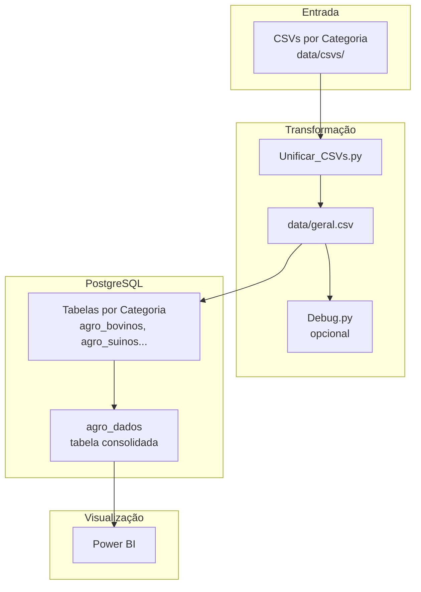

# Dados Agropecuários — ETL & Integração com Power BI

## Visão Geral

Este projeto implementa um pipeline ETL para consolidação de dados agropecuários a partir de múltiplos CSVs por categoria, carga estruturada no PostgreSQL e integração direta com Power BI para análise e visualização.

### Etapas do Pipeline

| Etapa                    | Descrição                                                                 | Script                  |
|--------------------------|---------------------------------------------------------------------------|-------------------------|
| **Unificação**           | Consolida todos os CSVs por categoria em um único arquivo                 | `Unificar_CSVs.py`      |
| **Validação**            | Testa a conexão com o banco e valida as credenciais do `.env`             | `Teste_Conexao.py`      |
| **Inspeção**             | Inspeciona intervalos de linhas do CSV antes da carga (opcional)          | `Debug.py`              |
| **Carga por categoria**  | Importa os dados criando uma tabela separada por categoria no PostgreSQL  | `Import_PostgreSQL.py`  |
| **Tabela consolidada**   | Gera `agro_dados` com tudo unificado, índices e NOT NULL — pronta pro BI | `Criar_TabelaUnica.py`  |

### Fluxo de Processamento

1. **Unificação** — Lê todos os arquivos em `data/csvs/`, extrai a categoria do nome do arquivo e gera `data/geral.csv`
2. **Validação** — Confirma acessibilidade do banco e integridade das credenciais
3. **Inspeção** — Inspeciona os dados opcionalmente antes de subir ao banco
4. **Carga por categoria** — Cria tabelas individuais (`agro_bovinos`, `agro_suinos`, etc.)
5. **Consolidação** — Unifica tudo na tabela `agro_dados` com índices otimizados para consulta no Power BI

---

### Dependências

```bash
pip install pandas sqlalchemy psycopg2-binary python-dotenv
```

Dependências principais:

- `pandas` — Leitura, unificação e transformação dos CSVs
- `sqlalchemy` — Conexão com PostgreSQL e carga dos dados
- `psycopg2-binary` — Driver PostgreSQL para Python
- `python-dotenv` — Leitura de variáveis de ambiente via `.env`

**Requisitos de ambiente:**

- Python >= 3.8
- PostgreSQL >= 12

---

## Estrutura do Projeto

```plaintext
.
├── data/
│   ├── csvs/                  # CSVs originais organizados por categoria
│   └── geral.csv              # Gerado pelo Unificar_CSVs.py
│
├── scripts/
│   ├── Unificar_CSVs.py       # Consolida os CSVs e extrai categoria do nome do arquivo
│   ├── Teste_Conexao.py       # Valida conexão e credenciais do banco
│   ├── Debug.py               # Inspeção de intervalos do CSV antes da carga
│   ├── Import_PostgreSQL.py   # Carga por categoria em tabelas separadas
│   ├── Criar_PublicTable.py   # Criação de tabelas no schema public
│   └── Criar_TabelaUnica.py   # Gera a tabela consolidada agro_dados
│
├── POSTGRESQL.sql             # DDL das tabelas
├── .env                       # Variáveis de ambiente (não versionado)
├── .gitignore
└── README.md
```

---

## Configuração

### Variáveis de Ambiente (`.env`)

```env
POSTGRES_USER=seu_usuario
POSTGRES_PASSWORD=sua_senha
POSTGRES_HOST=localhost
POSTGRES_PORT=5432
POSTGRES_DB=nome_do_banco
```

Após configurar o `.env`, execute os comandos do `POSTGRESQL.sql` para criar as tabelas:

```bash
psql -U seu_usuario -d nome_do_banco -f POSTGRESQL.sql
```

> O arquivo `.env` não é versionado e não deve ser enviado ao repositório.

---

## Execução

### 1. Unificar os CSVs

```bash
python scripts/Unificar_CSVs.py
```

Lê todos os arquivos em `data/csvs/`, extrai a categoria do nome do arquivo e gera `data/geral.csv`.

### 2. Testar conexão

```bash
python scripts/Teste_Conexao.py
```

### 3. Inspecionar os dados (opcional)

```bash
python scripts/Debug.py
```

Útil para conferir um intervalo de linhas do CSV antes de subir ao banco.

### 4. Importar por categoria

```bash
python scripts/Import_PostgreSQL.py
```

Cria uma tabela separada por categoria: `agro_bovinos`, `agro_suinos`, etc.

### 5. Gerar a tabela consolidada

```bash
python scripts/Criar_TabelaUnica.py
```

Gera a tabela `agro_dados` com todos os dados unificados, índices e constraints NOT NULL — pronta para consumo no Power BI.

---

## Modelo de Dados

### Transformação dos CSVs

**Formato original** (por arquivo de categoria):

```csv
periodo,valor
2020,1500000
```

**Após unificação** (`geral.csv`):

```csv
periodo,categoria,valor
2020,bovinos,1500000
```

### Tabelas no PostgreSQL

| Tabela              | Descrição                                                 |
|---------------------|-----------------------------------------------------------|
| `agro_bovinos`      | Dados brutos da categoria bovinos                         |
| `agro_suinos`       | Dados brutos da categoria suínos                          |
| `agro_<categoria>`  | Uma tabela por categoria presente nos CSVs                |
| `agro_dados`        | Tabela consolidada com todos os dados, índices e NOT NULL |

---

## Integração com Power BI

**Obter Dados → Banco de Dados PostgreSQL** → informe as credenciais do `.env` → importe a tabela `agro_dados`.

A tabela `agro_dados` é a fonte recomendada por estar consolidada, indexada e com tipos validados.

---

## Queries Úteis

### Contagem total de registros

```sql
SELECT COUNT(*) FROM public.agro_dados;
```

### Amostra dos dados

```sql
SELECT * FROM public.agro_dados LIMIT 10;
```

### Agregado por categoria

```sql
SELECT categoria, SUM(valor) AS total, AVG(valor) AS media
FROM public.agro_dados
GROUP BY categoria;
```

---

## Atualização de Dados

1. Adicione os novos CSVs em `data/csvs/`
2. Execute `Unificar_CSVs.py` para regenerar o `geral.csv`
3. Execute `Criar_TabelaUnica.py` para recriar a tabela consolidada
4. Atualize os dados no Power BI

---

## Solução de Problemas

| Erro                 | Causa provável                                        | Solução                                                   |
|----------------------|-------------------------------------------------------|-----------------------------------------------------------|
| Conexão recusada     | PostgreSQL não está rodando ou credenciais incorretas | Verifique o serviço do banco e as variáveis no `.env`     |
| CSV não encontrado   | Caminho incorreto ou pasta `data/csvs/` ausente       | Confirme o caminho e a existência da pasta                |
| Erro no Power BI     | Query ou configuração de conexão incorreta            | Teste a query diretamente no PostgreSQL antes de importar |

---

## Diagrama de Arquitetura


